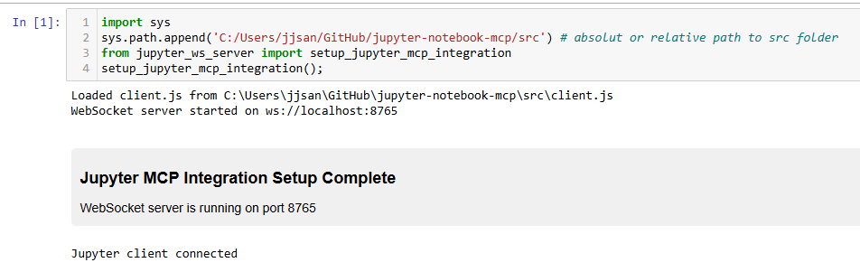

# Jupyter_MCP_Server
# JupyterMCP - Jupyter Notebook Model Context Protocol Integration

JupyterMCP connects [Jupyter Notebook](https://jupyter.org/) to [Claude AI](https://claude.ai/chat) through the Model Context Protocol (MCP), allowing Claude to directly interact with and control Jupyter Notebooks. This integration enables AI-assisted code execution, data analysis, visualization, and more.


## Features

- **Two-way communication**: Connect Claude AI to Jupyter Notebook through a WebSocket-based server
- **Cell manipulation**: Insert, execute, and manage notebook cells
- **Notebook management**: Save notebooks and retrieve notebook information
- **Cell execution**: Run specific cells or execute all cells in a notebook
- **Output retrieval**: Get output content from executed cells with text limitation options

## Components

The system consists of three main components:

1. **WebSocket Server (`jupyter_ws_server.py`)**: Sets up a WebSocket server inside Jupyter that bridges communication between notebook and external clients
2. **Client JavaScript (`client.js`)**: Runs in the notebook to handle operations (inserting cells, executing code, etc.)
3. **MCP Server (`jupyter_mcp_server.py`)**: Implements the Model Context Protocol and connects to the WebSocket server

## Installation

### Prerequisites

- [Python 3.12 or newer](https://www.python.org/downloads/) (probably also work with older versions, but not tested)
- [`uv` package manager](/README.md#installing-uv)
- [Claude AI desktop application](https://claude.ai/download)

#### Installing uv

If you're on Mac:

```bash
brew install uv
```

On Windows (PowerShell):

```bash
powershell -ExecutionPolicy ByPass -c "irm https://astral.sh/uv/install.ps1 | iex"
```

For other platforms, see the [uv installation guide](https://docs.astral.sh/uv/getting-started/installation/).

### Setup

1. Clone or download this repository to your computer:

   ```bash
   git clone https://github.com/jjsantos01/jupyter-notebook-mcp.git
   ```

2. Create virtual environment with required packages an install `jupyter-mcp` kernel, so it can be recognized by your jupyter installation, if you had one before.

   ```bash
   uv run python -m ipykernel install --name jupyter-mcp
   ```

3. (optional) Install additional Python packages for your analysis:

   ```bash
   uv pip install seaborn
   ```

4. Configure Claude desktop integration:
   Go to `Claude` > `Settings` > `Developer` > `Edit Config` > `claude_desktop_config.json` to include the following:

   ```json
      {
       "mcpServers": {
           "jupyter": {
               "command": "uv",
               "args": [
                   "--directory",
                   "/ABSOLUTE/PATH/TO/PARENT/REPO/FOLDER/src",
                   "run",
                   "jupyter_mcp_server.py"
               ]
           }
       }
   }
   ```

   Replace `/ABSOLUTE/PATH/TO/` with the actual path to the `src` folder on your system. For example:
   - Windows: `"C:\\Users\\MyUser\\GitHub\\jupyter-notebook-mcp\\src\\"`
   - Mac: `/Users/MyUser/GitHub/jupyter-notebook-mcp/src/`

   If you had previously opened Claude, then `File` > `Exit` and open it again.

## Usage

### Starting the Connection

1. Start your Jupyter Notebook (version 6.x) server:

   ```bash
   uv run jupyter nbclassic
   ```

2. Create a new Jupyter Notebook and make sure that you choose the `jupyter-mcp` kernel: `kernel` -> `change kernel` -> `jupyter-mcp`

3. In a notebook cell, run the following code to initialize the WebSocket server:

   ```python
   import sys
   sys.path.append('/path/to/jupyter-notebook-mcp/src')  # Add the path to where the scripts are located
   
   from jupyter_ws_server import setup_jupyter_mcp_integration
   
   # Start the WebSocket server inside Jupyter
   server, port = setup_jupyter_mcp_integration()
   ```

   Don't forget to replace here `'/path/to/jupyter-notebook-mcp/src'` with `src` folder on your system. For example:
   - Windows: `"C:\\Users\\MyUser\\GitHub\\jupyter-notebook-mcp\\src\\"`
   - Mac: `/Users/MyUser/GitHub/jupyter-notebook-mcp/src/`

   

4. Launch Claude desktop with MCP enabled.

### Using with Claude

Once connected, Claude will have access to the following tools:

- `ping` - Check server connectivity
- `insert_and_execute_cell` - Insert a cell at the specified position and execute it
- `save_notebook` - Save the current Jupyter notebook
- `get_cells_info` - Get information about all cells in the notebook
- `get_notebook_info` - Get information about the current notebook
- `run_cell` - Run a specific cell by its index
- `run_all_cells` - Run all cells in the notebook
- `get_cell_text_output` - Get the output content of a specific cell
- `get_image_output` - Get the images output of a specific cell
- `edit_cell_content` - Edit the content of an existing cell
- `set_slideshow_type`- Set the slide show type for cell

